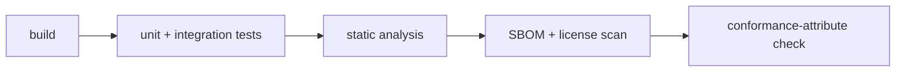
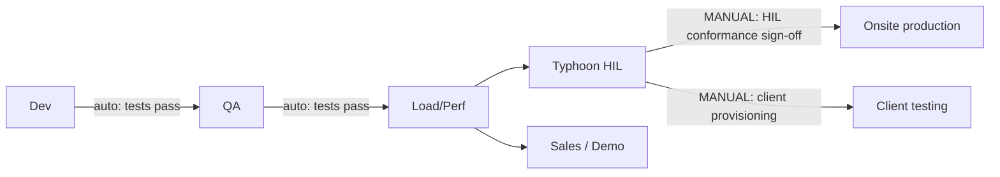

# SAH-BESS Delivery Pipeline

This is the parent SDLC program for SAH-BESS. The Intelligent Controller is sub-project A within it.

## Guiding principle: automation-first, with manual approval gates

Every promotion is **fully automated** (build, test, scan, deploy, verify) but **cannot advance past a
gate without an explicit human approval**. Approval gates are implemented with **GitHub Environments +
required reviewers** (the repository is hosted on GitHub). Infrastructure is **Terraform (IaC)** so
environments are reproducible and vendor-neutral, and ephemeral ones can be spun up and torn down on
demand. The CI platform recommendation (GitHub Actions) is captured in
[ADR-0007](../adr/0007-ci-platform.md).

## CI — on every pull request

- **Coverage:** line coverage is **measured and published to a dashboard (80% goal)**, **not a blocking
  gate** — emergency fixes may temporarily dip below 80%; the dashboard flags prominently when below.
- **License/SBOM scan:** generates a Software Bill of Materials and verifies dependency licenses,
  enforcing the "prefer open source" policy and supporting audit.
- **Conformance-attribute check:** the Roslyn analyzer rejects any `[Conformance(Standard=…)]`
  referencing an ID absent from [`register.yaml`](../standards/register.yaml); the RTM artifact is
  produced.

## CD — progressive promotion

Each hop is an **automated deploy + automated test suite**. **QA and Load/Perf promote automatically**
when their test suites (unit, integration, regression, performance) pass — they are **not** manual
gates. Manual approval gates apply only at the points listed below.

### Mandatory manual gates

A human approval is required before:

1. **HIL conformance sign-off** — IEEE 1547.1 scenarios pass on the rig.
2. **Client-environment provisioning** — spinning up an isolated per-client environment.
3. **Onsite production release** — deploying to a physical site.

## Ephemeral environments

- Provisioned by **Terraform**, triggered by a PR label (preview) or on demand (Sales/Client).
- **Auto-torn-down on TTL** to control cost and avoid drift.

See [`environments.md`](environments.md) for the full environment set and
[`traceability.md`](traceability.md) for how releases stay auditable.
